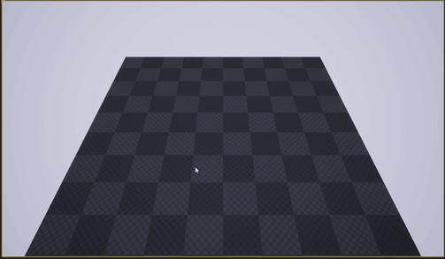
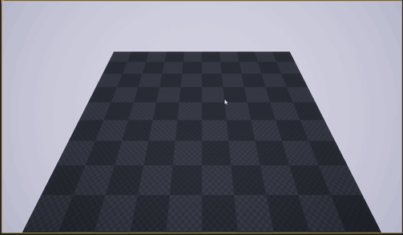
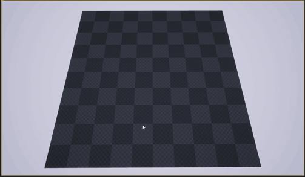

# Strategy Camera Movement in Unreal

This is a Strategy Camera Movement template with features such as Camera Zoom and Edge Scrolling.  The template is available in C++ and Blueprint.

> **Features**
> - Camera Zoom
> - Camera Movement
> - Camera Edge Scrolling

 <h1>Edge Scrolling</h1>

  

 <h1>Rotate View or Tilt Camera</h1>

   
  <caption>Hold Mouse Wheel</caption>

 <h1>Zoom to Mouse Position</h1>

  

[Contact Me on Twitter](https://twitter.com/amiransari09 "Twitter")
